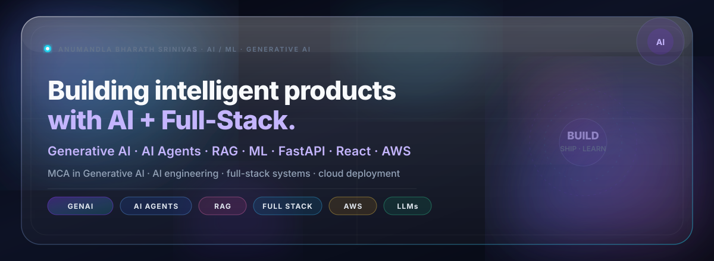
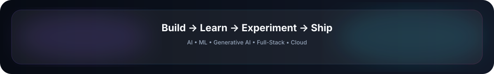

 

  

---

## 🧊 About Me

I’m an **AI / ML and Generative AI developer** focused on building intelligent, production-ready applications.

My work combines **LLMs, RAG, AI Agents, Machine Learning, Full-Stack Development, and Cloud technologies** to turn ideas into practical products.

Currently focused on growing as an **AI Full-Stack Engineer** while expanding my expertise in **AWS and scalable AI systems**.

---

## ✨ What I Build

  

  

# 🛠️ Tech Stack

## 🤖 AI / ML / Data Science

## 🧠 Generative AI

## ⚛️ Frontend

## 🖥️ Backend

## 🗄️ Databases

## ☁️ Cloud & Deployment

## 🧰 Tools

---

# 🚀 Featured Projects

<table>
<tr>
<td width="50%" valign="top">

## 🤖 AI Paper Checker Agent

AI-powered answer-sheet evaluation platform.

**Features**

- OCR answer extraction
- AI answer evaluation
- Automatic marks suggestions
- Teacher review workflow
- Results generation
- Analytics

**Stack**

`React` `FastAPI` `PostgreSQL` `OCR` `GenAI` `AWS`

</td>

<td width="50%" valign="top">

## 🏢 AI-Powered Mini ERP

AI-enhanced manufacturing ERP platform.

**Features**

- ERP Copilot
- Smart Procurement
- Demand Forecasting
- Inventory intelligence
- Manufacturing workflows
- Business insights

**Stack**

`React` `Laravel` `FastAPI` `Gemini` `PostgreSQL`

</td>
</tr>

<tr>
<td width="50%" valign="top">

## 📈 AI Stock Market Assistant

Exploring a multi-agent architecture for market analysis, trading analysis, news analysis and decision-support workflows.

**Focus**

`AI Agents` `RAG` `Market Analysis` `Automation`

</td>

<td width="50%" valign="top">

## 🧠 AI Engineering

Currently exploring:

- LLM applications
- RAG pipelines
- AI agents
- Tool calling
- Prompt engineering
- Intelligent automation

</td>
</tr>
</table>

---

# 📊 GitHub Analytics

  

---

# 💻 LeetCode

---

# 🎯 Current Focus

🤖 **AI / ML Engineering**

⬇️

🧠 **Generative AI**

⬇️

🌐 **AI Full-Stack Engineering**

⬇️

☁️ **Cloud & AI Systems**

  

`AWS` · `Docker` · `RAG` · `AI Agents` · `LLM Engineering` · `Cloud`

---

  

  

<i>Building intelligent products. Learning continuously. Shipping consistently. 🚀</i>

